# **0. 플러터 동작 방식**
플러터는 비디오 게임처럼 운영체제와 대화하지 않고 엔진을 이용해서 렌더링한다.<br>
운영체제는 그 엔진을 동작시키기만 한다.
## **0-1. 플러터 vs 리액트 네이티브**
플러터는 운영체제와 대화하지 않고 자체 C/C++ 엔진을 사용하기에 운영체제마다 스타일이 달라지지 않는다.<br>
리액트 네이티브는 운영체제와 직접적으로 대화하기에 같은 코드라도 운영체제 스타일에 맞게 변한다.<br>
그렇기에 플러터는 리액트 네이티브와 다르게 커스터마이징 된 디자인을 가질 수 있다.

## **0-2. Widget**
플러터에 모든 것은 위젯으로 이루어져 있다. 이 위젯들을 합치는 방식으로 앱을 만든다.<br>
`flutter create (프로젝트명)` 명령어로 프로젝트를 만들면 lib 폴더에 main.dart 파일이 있고, runApp() 함수가 있다.
```dart
// lib/main.dart
import 'package:flutter/material.dart';

void main() {
  runApp(/*위젯*/);
}
```
runApp()에 인자에는 클래스 형태인 위젯이 들어가는데 위젯을 만들기 위해서는 flutter SDK에 3개의 코어 위젯 중 하나를 상속받아야 한다.
```dart
// lib/main.dart
import 'package:flutter/material.dart';

void main() {
  runApp(App());
}

class App extends StatelessWidget {

}
```
그리고 StatelessWidget을 상속받은 클래스는 build() 메소드를 구현해줘야 한다.
```dart
...
class App extends StatelessWidget {
  @override
  Widget build(BuildContext context) {
    
  }
}
```
이 App 위젯을 루트 위젯이라고 하고 이 위젯의 build() 메소드는 MaterialApp 위젯 또는 CupertinoApp 위젯, 이 두개 중 하나를 반환해야한다.

Material과 Cupertino는 각각 구글과 애플의 디자인 시스템이다. 각각 구글 또는 iOS 느낌을 내고 싶을 때 선택하면 된다.

근데 플러터는 구글에서 만든 제품이기에 MaterialApp을 많이 선택된다고 한다.
```dart
class App extends StatelessWidget {
  @override
  Widget build(BuildContext context) {
    return MaterialApp();
  }
}
```
MaterialApp의 인자에 home 이라는게 이 인자의 인수로 또다른 위젯을 넣어주면 된다.

플러터에서 모든 화면은 Scaffold 위젯을 가져야 한다.<br> Scaffold 위젯은 화면의 구조를 제공해준다.

Scaffold는 body 인자에 위젯이 들어가는데 Text 위젯을 이용하여 글자를 입력할 수도 있다.
```dart
...
Widget build(BuildContext context) {
    return MaterialApp(
        home: Scaffold(
            body: Text('Hello, world');
        )
    );
}
```
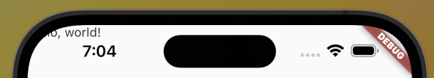

왼쪽 상단에 글자가 잘 뜨는 것을 확인할 수  있다.

Scaffold에 appBar라는 인자에도 위젯을 넣을 수 있다.<br>
```dart
...
return MaterialApp(
    home: Scaffold(
        appBar: AppBar(
            title: Text('Hello, flutter!'),
        ),
        body: Text('Hello, world');
    )
);
```
appBar 인자에 AppBar 위젯을 인수로 주고,<br>
AppBar 위젯에 title 인자에는 Text 위젯을 주었다.

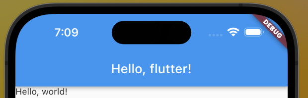

상단에 AppBar가 잘 뜨는 것을 확인할 수 있다.

아래 텍스트를 가운데에 두고싶다면 Center()라는 또다른 위젯을 사용하면 된다.
```dart
return MaterialApp(
    home: Scaffold(
        appBar: AppBar(
            title: Text('Hello, flutter!'),
        ),
        body: Center(
            child: Text('Hello, world'),
        ),
    )
);
```
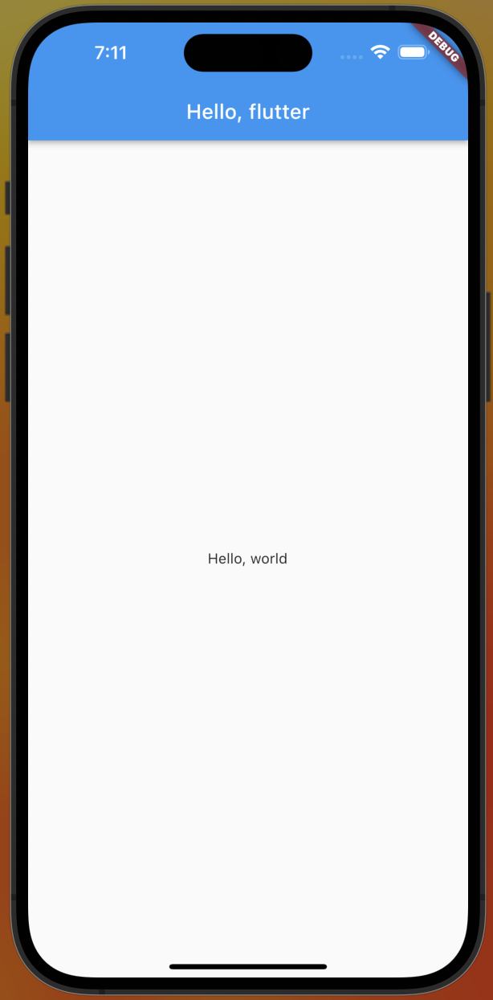

그럼 글자가 가운데에 잘 나타난다.

CSS의 모든 속성을 다 기억하고 있지 않듯이 위젯을 다 기억할 필요는 없다.<br>
문서를 찾아봐도 되고, VSC에 Extension이 보여주는 힌트를 볼 수도 있다.

# **1. 코인 앱**

## **1-1. 헤더에 사용된 위젯**

### **Text**
글자를 나타낼 때 쓰는 위젯이다.<br>
style 파라미터가 있는데 TextStyle 위젯을 통해 글자색, 폰트 사이즈, 굵기를 정할 수 있다.

### **Color / Colors**
글자색이나 배경색 등을 정할 때 쓰는 위젯이다.<br>
Color 위젯을 쓰면 커스텀 색상을 정할 수 있고, Colors 위젯을 쓰면 지정돼 있는 다양한 색상들을 사용할 수 있다.

### **Column, Row**
Column과 Row이라는 위젯이 있는데 CSS에 display: flex에 flex-direction: column과 row와 비슷하다.<br>
children 파라미터에 리스트 형태로 요소들을 넘기면 된다.

CSS에 justify-content나 align-items 속성은 각각 mainAxisAlignment와 crossAxisAlignment 파라미터와 같다.

### **SizedBox**
사이즈가 있는 박스를 만들때 쓰는 위젯이다.<br>
간격을 추가하거나 할 때 쓸 수 있다.

### **Padding**
패딩을 줄 수 있는 위젯이다.<br>
padding 파라미터에 EdgeInsetsGeometry와 EdgeInsetsGeometry를 상속받은 위젯을 넘길 수 있다.

### **EdgeInsets**
패딩에 값을 줄 때 사용할 수 있다.<br>
EdgeInsets.all()은 모든 방향에 값을 줄 수 있고,<br>
EdgeInsets.only()는 각각의 방향에 값을 지정해줄 수 있고,<br>
EdgeInsets.symmetric()는 수평, 수직 방향에 값을 줄 수 있다.

## **1-2. 개발자 도구**
VSC에서 오른쪽 위에 디버깅 시작하기를 누르면 위에

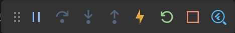

메뉴가 뜨는데 제일 오른쪽에 돋보기 + 플러터 로고 버튼을 누르면 개발자 도구 창이 뜬다.<br>
여기서는 위젯 트리, 위젯 속성들을 간편하게 볼 수 있고 수정도 할 수 있다.

창에 왼쪽 위에

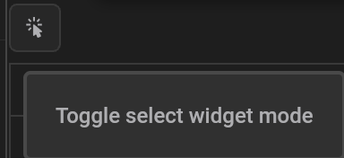

Toggle select widget mode 라는 버튼이 있는데 누르면 요소를 클릭해서 살펴볼 수 있다.
<br>
그 오른쪽엔

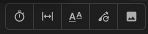

메뉴들이 보이는데 왼쪽에서 두번째 버튼을 누르면 레이아웃 가이드라인을 볼 수 있다.

## **1-3. 버튼 섹션에 사용된 위젯**

### **Container**
Container 위젯은 html에 div태그 같은거다.<br>
decoration 파라미터로 이 위젯을 꾸밀 수 있고 Decoration 위젯이나 이 위젯을 상속 받은 위젯이 들어올 수 있다.

### **BoxDecoration**
Decoration 위젯을 상속받은 위젯으로 Container 위젯을 꾸밀 수 있다.<br>
BoxDecoration으로 배경색을 지정하거나 모서리에 둥근 정도를 지정할 수 있다.

## **1-4. 플러터 constant 경고 세팅**
VSC에서 위젯들을 사용해서 작업하다보면 몇몇 위젯에 파란줄로 const를 붙여서 상수로 만들라는 경고가 뜬다.

settings.json에서
```json
"editor.codeActionsOnSave": {
    "source.fixAll": true
}
```
위 옵션을 넣으면 저장할 때 VSC가 자동으로 const를 붙여서 해결해준다.

추가로
```json
"dart.previewFlutterUiGuides": true
```
설정을 추가해주면

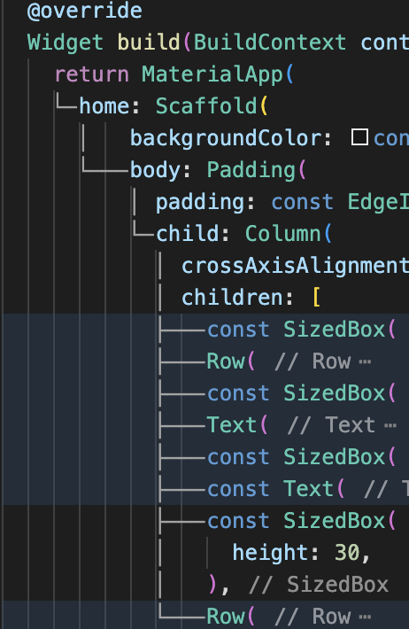

처럼 선으로 트리를 그려준다.

## **1-5. 코드 액션**
VSC에서 위젯을 클릭하면

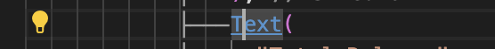

왼쪽에 전구가 코드 작업 보이기 버튼이 보이는데 추가 작업란에 다양한 리펙토링 옵션들을 보여준다.<br>
Text 위젯같은 경우엔

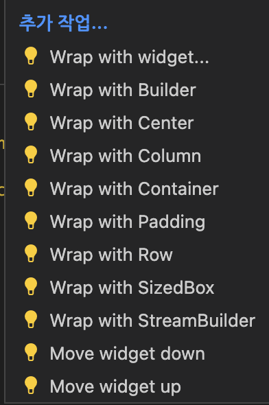

이러한 추가 작업들을 보여주는데 패딩 위젯으로 감싸거나 컨테이너 위젯으로 감싸는 등의 옵션들이 존재한다.

## **1-6. Reusable Widget**
재사용하고 싶은 위젯을 클릭하고 코드 작업 보이기 버튼을 누르면

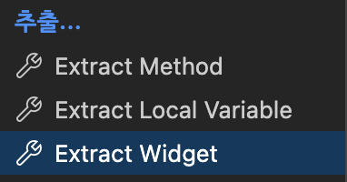

추출에 Extract Widget 옵션이 존재한다.

Extract Widget 옵션을 누르면 위젯 이름을 입력하는 창이 나오고 입력하고 엔터를 누르면 밑에 별도의 위젯이 하나 만들어진다.

새로운 dart 파일을 만들어서 위젯을 따로 묶을 수 있다.<br>
리액트, 스벭트에 컴포넌트처럼 쓸 수 있는 것이다.

스벨트와 비슷하게 따로 export 같은 구문없이 import로 불러오기만 하면 된다.

## **1-7 아이콘 사용하기**

### **Icon**
Icon 위젯으로 아이콘을 사용할 수 있고, 첫번재 인자에 IconData 위젯이나 이 위젯을 상속받은 위젯이 들어온다.<br>
그 중에 Icons 라는 위젯이 있는데 다양한 아이콘들을 제공한다.

VSC에선 Icons에 있는 다양한 아이콘들을 힌트로 보여준다.

### **Transform**
Transform 위젯은 현재 위치에서 차지하는 공간은 바뀌지 않고 외형만 바꿀 때 사용한다.<br>
CSS에서 position absolute인 상태에서 위치나 크기를 변형시킨 것과 같은 느낌이다.

Transform.scale을 사용하면 scale 파라미터로 크기를 조절할 수 있다.<br>
Transform.translate를 사용하면 offset 파라미터로 위치를 조정할 수 있다.

### **Container(clipBehavior:)**
Container에 clipBehavior는 오버플로우된 요소들을 어떻게 처리할지 나타내는 파라미터다.<br>
clipBehavior에 Clip.hardEdge 위젯을 주면 오버플로우된 부분이 사라진다.

### **private**
만약에 클래스에 프로퍼티나 메소드의 접근 제한자를 private으로 만들고 싶다면 앞에 _를 붙이면 된다.

### **스크롤뷰 만들기**
SingleChildScrollView를 사용하면 스크롤 가능한 뷰를 만들어준다.<br>
그냥 감싸기만 하면 된다.

# **2. StateFul Widget**
VSC에서 st만 쓰면 Statefull, Stateless 위젯을 상속받은 클래스를 자동완성해주는 옵션을 제공해준다.

그리고 VSC에서 Stateless 위젯에 커서를 올리고 코드 액션 보기 버튼을 누르면 StateFull 위젯으로 바꿔주는 옵션을 보여준다.

## **2-1. State**
플러터에서 state는 클래스에 프로퍼티로 구현한다.

IconButton이라는 위젯이 있는 이 위젯은 onPressed 파라미터로 state 변경 함수와 icon 파라미터로 Widget을 받는다.

## **2-2. SetState**
setState 함수는 State 클래스에게 데이터가 변경되었다고 알리는 함수이다.

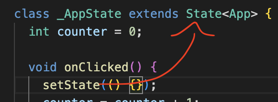

setState를 쓰지 않으면 데이터가 변경되어도 반영이 되지 않는다.

setState를 호출만 해줘도 데이터 변경이 반영되자만, setState함수 안에 익명함수에 state 변경 코드를 넣어도 된다.
```dart
setState(() {});
counter = counter + 1;
// 위아래 둘 다 작동함
setState(() {
    counter = counter + 1;
});
```

그런데 가독성을 위해 setState함수 내에 넣는게 더 낫다.

## **2-3. BuildContext**

### **MaterialApp(theme:)**
MaterialApp에 theme 파라미터는 애플리케이션의 스타일 시트를 지정할 때 사용하고 ThemeData 위젯이 들어간다.<br>
만약 자식 위젯이 부모 위젯에 theme 데이터에 접근할 때 Theme.of(context)로 접근할 수 있다.<br>
이때 build 메서드의 파라미터인 BuildContext가 쓰인다.

BuildContext는 build 메서드에 기본 파라미터로, 자식 위젯이 부모 위젯의 context에 접근해 Theme 등 다양한 정보를 가져올 때 사용한다.<br>
기본적으로 가까운 부모 위젯에 접근한다.

## **2-4. Widget Lifecycle**
플러터에 Stateful Widget에는 생명주기가 있다.

1. initState()

    initState()는 build() 메소드가 호출되기 전에 제일 먼저 호출된다.<br>
    initState는 단 한번만 호출된다.

    initState()는 부모 요소에 의존하는 데이터를 초기화하거나 context에 의존하는 것들의 데이터를 초기화할 때 사용할 수 있다.
2. dispose()

    dispose() 메소드는 위젯이 스크린에서 제거될 때 호출되는 메소드이다.

# **3. 뽀모도로 앱**

### **Flexible**
Flexible 위젯은 하나의 박스가 공간을 차지하는 비율을 정할 수 있다.<br>
flex 파라미터로 정할 수 있고 CSS에서 flex 컨테이너 내에 요소에 flex 속성을 지정하는 것과 비슷하다.

### **Expanded**
Expanded 위젯은 요소를 비어있는 공간까지 확장시켜준다.<br>
CSS에서 aline-items: stretch; 속성과 비슷하다.

### **Timer**
Timer는 다트 표준 라이브러리에 들어있는 위젯이다.<br>
Timer를 통해 정해진 간격에 한번씩 함수를 호출시킬 수 있다.<br>
이때 Timer.periodic() 메소드가 쓰인다.

Timer.periodic() 메소드는 주기마다 함수를 실행시킨다.
```dart
Timer Timer.periodic(Duration duration, void Function(Timer) callback)
```
Timer 객체를 반환하고, 첫번째 인자의 길이마다 두번째 인자에 callback 함수를 실행시킨다.

반환된 timer 객체에 .cancel() 메소드를 통해 타이머를 정지시킬 수 있다.

# **3. 웹툰 앱**
## **3-1. Data Fetching**
### **Future**
Future는 JS에 Promise와 비슷하다.<br>
심지어 플러터도 JS처럼 async, await이 존재하는데 async는
```dart
void 함수명() async {

}
```
처럼 쓴다는 것 외에는 거의 비슷하다.<br>
Future가 JS에 Promise와 비슷하다고 했으니, async 함수에서 await과 함께 쓼 수 있다.

async 함수가 반환하는 것도 JS와 비슷하게 Future를 반환한다.<br>
때문에 async 함수가 반환하는 타입을 Future로 한 번 묶어줘야 한다.
```dart
Future<int> 함수명() async {
    return 1;
}
```

### **http 라이브러리**
http 라이브러리는 dart 팀에서 만든 라이브러리로 JS에 fetch처럼 특정 url에 요청을 보내 데이터를 받아오는 기능을 지원한다.<br>

`http.get(Uri 객체)` 처럼 쓰면 되고 Future로 감싸진 Response 객체를 반환한다.<br>
반환받은 Response 객체에 .statusCode 프로퍼티로 http 상태코드를 볼 수 있고 데이터는 .body 프로퍼티에 담겨져 있다.

http.get()으로 받은 json을 다트에 내장된 jsonDecode()함수를 이용하면 다트에서 쓸 수 있는 자료형으로 변환된다.

## **3-2. FutureBuilder**
FutureBuilder 위젯은 데이터를 fetch할 필요 없이 바로 UI에 띄울 수 있게 해주는 위젯이다.

FutureBuilder에는 future라는 파라미터가 있는데 여기에 API에서 이런데서 받는 데이터를 감싼 Future 객체를 넣을 수 있고<br>
builder에는 context와 snapshot 파라미터가 있는 함수가 들어온다.
```dart
FutureBuilder(
    future: (Future객체),
    builder: (context, snapshot) {

    }
)
```
builder에서 반환한 위젯이 화면에 뜨게 되고, 데이터는 snapshot에서 가져올 수 있다.<br>
snapshot을 통해 Future의 상태를 알 수 있고 데이터를 가져올 수 있다.

## **3-3. ListView**
ListView는 children 파라미터에 리스트내 요소들을 보여준다.<br>
ListView는 스크롤이 구현돼 있다.

ListView는 데이터 만큼 메모리에 공간을 차지하기 때문에 데이터가 많을 수록 비효율적이다.

### **ListView.builder**
ListView.builder()는 사용자가 보고 있는 데이터만 build하기에 유튜브나 인스타그램처럼 데이터가 무한한 앱같은 경우에 쓰기 좋다.<br>
다음 파라미터가 존재한다.
```dart
ListView.builder(
    scrollDirection: (방향),
    itemCount: (전체 데이터 개수),
    itemBuilder: (context, index) {}
)
```
itemBuilder에는 함수가 들어가는데 두번째 인자에 index로 데이터의 인덱스를 가져올 수 있다.<br>
index에는 현재 스크린에 보이는 위젯의 인덱스가 들어가있다.

### **ListView.separated**
ListView.separated()는 ListView.builder()에서 separatorBuilder 인자를 하나 더 작성해주면 된다.<br>
separatorBuilder 파라미터는 함수를 인자로 받는데 이 함수가 반환하는 위젯을 리스트 아이템 사이사이에 렌더링 시켜준다.
```dart
ListView.separated(
    scrollDirection: (방향),
    itemCount: (전체 데이터 개수),
    itemBuilder: (context, index) {},
    separatorBuilder: (context, index) => (위젯)
)
```

## **3-4. Route**

### **Image**
Image 위젯은 이미지를 띄워주는 위젯이다.<br>
Image.network()는 첫번째 인자에 이미지의 주소로 이미지를 보여준다.

### **GestureDetector**
GestureDetector 위젯은 스크린에 동작을 감시하고 모든 동작들을 파라미터로 정의해둔 위젯이다.

GestureDetector 위젯에 모든 동작들엔 실행시킬 함수가 들어온다.<br>
onTap 파라미터는 손가락을 누르고 올렸을 때 함수를 실행시킨다.

### **Navigator**
Navigator 위젯은 다른 route로 전환하거나 돌아오게 만들어주는 위젯이다.

.push(), .pop() 메소드를 사용할 수 있는데 이 메소드의 첫번째 인자에는 context가 들어가고 .push()는 추가로 두번째 인자에 **Route 클래스의 객체가 들어간다.**

Route 클래스를 상속받은 위젯 중에 MaterialPageRoute라는 위젯이 있다.

MaterialPageRoute 위젯에는 builder라는 함수를 받는 파라미터가 있는데 이 파라미터가 반환하는 위젯이 .push() 메소드로 이동하는 스크린이 된다.

MaterialPageRoute는 애니메이션이 존재하는데 fullscreenDialog 파라미터를 true로 해두면 밑에서 부터 스크린이 올라온다.

이때 새로운 스크린에도 Scaffold 위젯이 존재해야한다.

### **Hero**
Hero 위젯은 스크린이 이동할 때 기존 스크린에 있던 요소를 새로운 스크린으로 이동하는 효과를 주고 싶을 때 사용한다.<br>
기존 스크린에 있던 이미지와 새로운 스크린에 있는 이미지를 Hero 위젯으로 감싸고, tag 파라미터에 같은 값을 주기만 하면 된다.

## **3-5. 프로퍼티가 있는 StatefulWidget**
StatefulWidget의 State 클래스에서 StatefulWidget에 프로퍼티에 접근하려 widget.프로퍼티 형식으로 접근하면 된다.

만약 StatelessWidget을 상속받은 클래스에 어떤 프로퍼티가 같은 클래스내에 또다른 프로퍼티를 이용하여 어떤 값을 받으면 에러가 나는데, 이를 StatefulWidget으로 변경함으로써 해결할 수 있다.

예를 들어 아래와 같은 StatelessWidget이 있을 때
```dart
class NiceWidget extends StatelessWidget {
    final int one = 1;
    final int doubled_number = one * 2;
    ...
}
```
위처럼 하면 에러가 나는데

StatefulWidget을 사용하면
```dart
class NiceWidget extends StatefulWidget {
    final int one = 1;
    @override
    State<NiceWidget> createState() => _NiceWidgetState();
}

class _NiceWidgetState extends State<NiceWidget> {
    late final doubled_number;

    @override
    void initState() {
        super.initState();
        doubled_number = widget.one;
    }
    ...
}
```
위처럼 initState()를 이용해서 해결할 수 있다.